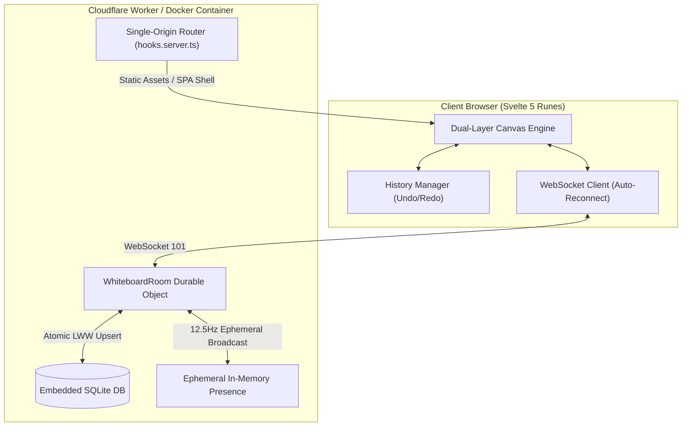

<p align="center">
  
</p>

<h1 align="center">Mesh</h1>

<p align="center">
  <strong>Fast, distraction-free real-time collaborative vector whiteboard.</strong><br />
  Built on SvelteKit 2 (Svelte 5 Runes) and Cloudflare Workers (Durable Objects with embedded SQLite &amp; WebSocket Hibernation).
</p>

<p align="center">
  <a href="https://github.com/VUXXE/Mesh/releases/tag/v1.0.0"></a>
  <a href="#key-features"></a>
  <a href="#key-features"></a>
  <a href="#architecture--storage"></a>
  <a href="#self-hosting-with-docker"></a>
  <a href="#-quick-start"></a>
  <a href="LICENSE"></a>
</p>

<br />

## Highlights

- **Edge-Native & Zero-Worker SPA:** Canvas pages load as a static SPA via Cloudflare Assets at 0 Worker invocations. WebSocket upgrades and dynamic routing execute directly on the same origin without reverse proxies or CORS.
- **Embedded SQLite Persistence:** Each room is powered by a dedicated `WhiteboardRoom` Durable Object with transactional SQLite storage and monotonic Last-Write-Wins (LWW) conflict resolution.
- **WebSocket Deep Hibernation:** Zero background timers or sleep locks. Socket connections hibernate in edge memory with state preserved in socket attachments until packets arrive.
- **Client-Side Cursor LERP Interpolation:** 60–120fps peer cursor rendering on an interactive overlay using exponential smoothing ($1 - e^{-25 \times \Delta t}$), while keeping network presence broadcasts throttled to 80ms (~12.5Hz).
- **Dual-Layer Canvas Architecture:**
  - _Committed Static Buffer:_ Re-rendered only upon shape mutations or viewport transformations.
  - _Interactive Overlay:_ Renders active drawing previews, selection handles, and interpolated peer cursor positions without redrawing static canvas elements.
- **Self-Hostable Anywhere:** Deploy to Cloudflare Workers with one command, or run via Docker and Docker Compose with embedded SQLite persistence. Zero external database dependencies.

---

## 🚀 Quick Start

Run the full-stack whiteboard application (UI + WebSockets + embedded SQLite) locally in under a minute:

```bash
# 1. Clone the repository
git clone https://github.com/VUXXE/Mesh.git
cd Mesh

# 2. Install dependencies
bun install

# 3. Start the application
bun start
```

Open [http://localhost:4173](http://localhost:4173) in your browser. Open an Incognito window to test live multi-user collaboration!

---

## Key Features

### ✏️ Vector Drawing Suite

- **Freehand Pen:** High-precision path capture with client-side Ramer-Douglas-Peucker (RDP) trajectory smoothing.
- **Geometric Shapes:** Rectangles, ellipses, straight lines, and directional arrows with customizable stroke colors, fill shades, and stroke widths.
- **Collaborative Notes:** Vector text labels and sticky notes with multi-line editing, font families (Sans, Serif, Mono), font sizes, and color tags.
- **Interactive Manipulation:** Hit testing for selection, multi-shape drag translation, 8-handle resize boxes (including pen and arrow paths, with Shift aspect-ratio lock), bounding boxes, and deletion.
- **Light & Dark Theme:** Sun/moon toggle in the header with canvas, grid, and export colors following the active theme. Preference persists in local storage.

### 🔒 Room Passwords & Security

- **Optional Lock:** Set a password (4-128 characters) when creating a room from the landing page.
- **Auth Gate & Isolation:** Joiners must enter the password to view canvas contents. Shapes, cursors, selection state, and mutations are withheld from unauthenticated sockets.
- **PBKDF2 Hashing:** Passwords are salted and hashed using PBKDF2-SHA256 (100,000 iterations via `crypto.subtle`). Plaintext passwords are never stored. Auth state is persisted in the socket attachment across hibernation.
- **Auth Rate Limiting:** Sockets incur a 5-second backoff after 5 failed authentication attempts, and are disconnected (`1008`) after 10 failed attempts to prevent brute-forcing.
- **Connection Eviction & Timeout:** Unauthenticated sockets are evicted when a locked room reaches its 50-connection ceiling, and an unauthenticated connection timeout closes inactive unauthenticated sockets after 15 seconds.
- **LWW Clock-Skew Clamping:** Client mutation timestamps (`updatedAt`) are clamped to `Date.now() + 5000` (allowing 5 seconds of clock skew) to prevent future-dated timestamps from locking shapes against edits.
- **Input Validation & Resilience:** Shape payloads are validated against allowed types (`path`, `rectangle`, `ellipse`, `line`, `arrow`, `text`, `sticky_note`) with sanitized numeric coordinates before entering SQLite transactions.

### 👥 Real-Time Collaboration & Presence

- **Client-Side LERP Interpolation:** Remote peer cursors run an exponential smoothing loop ($1 - e^{-25 \times \Delta t}$) via `requestAnimationFrame` on the interactive overlay layer, delivering 60–120fps motion from 80ms network packets.
- **Adaptive Ephemeral Broadcasting:** Cursor coordinates broadcast at 80ms (~12.5Hz) only when active peers share the room.
- **Coordinate Quantization:** Coordinates are rounded to 1 decimal place before transmission, cutting presence JSON payload size by ~46%.
- **Solo Room Silence:** When alone in a room, continuous cursor streaming is suppressed, dropping idle presence traffic to zero.
- **Deadband Filtering:** Sub-2px micro-movements and resting cursor states are skipped to eliminate redundant network frames.
- **Tab Visibility & Disconnect Fade:** Hidden tabs (`visibilitychange`) suspend broadcasts and hide cursors. Disconnected peers fade out smoothly over 200ms rather than vanishing abruptly.
- **Custom Identity:** Live user avatars with customizable display names and signature colors saved in local storage.
- **Zero-Storage Presence:** Cursor coordinates and selection packets are routed exclusively in memory and never touch SQLite.

### ⏪ Multi-Level History (Undo / Redo)

- Full local history stack supporting `Ctrl+Z` and `Ctrl+Y` / `Ctrl+Shift+Z`.
- Tracks batch additions, property modifications, spatial translations, and shape deletions with immediate optimistic UI updates.

### 📱 Touch Gestures & Navigation

- **Pinch-to-Zoom:** Native two-finger pinch gesture scaling centered precisely around the touch midpoint.
- **Two-Finger Pan:** Two-finger canvas panning on mobile devices and trackpads with touch-action isolation.
- **MiniMap Radar:** Real-time bird's-eye canvas overview with clickable quick-pan viewport positioning.

### 💾 Backup & Export

- **Export to PNG:** High-resolution bitmap snapshot rendering only the populated shape bounds.
- **Export to SVG:** Pure vector graphic export suitable for Figma, Illustrator, or web embedding.
- **Export to JSON:** Human-readable backup containing complete room vector states.
- **Import from JSON:** One-click restoration from any previous JSON room backup.

---

## Architecture & Storage



### Modular Architecture

- **Client Canvas Subsystems:**
  - **`CanvasEngine`** ([`canvas-engine.ts`](src/lib/client/canvas-engine.ts)): Lean coordinator managing viewport transforms, dual-buffer invalidation, state synchronization, undo/redo history, and 60–120fps LERP cursor animation.
  - **`InteractionController`** ([`canvas-interactions.ts`](src/lib/client/canvas-interactions.ts)): Pointer and multi-touch gestures (pinch-zoom, two-finger pan), shape translation, 8-handle resize transformations, and marquee selection.
  - **`CanvasRender`** ([`canvas-render.ts`](src/lib/client/canvas-render.ts)): Pure rendering functions for all shape primitives, bounding boxes, resize handles, smooth cursor interpolation, and 60fps drawing previews.
  - **`CanvasExport`** ([`canvas-export.ts`](src/lib/client/canvas-export.ts)): High-res PNG rendering, pure vector SVG generation, and JSON room backup/restore.
  - **`CanvasText`** ([`canvas-text.ts`](src/lib/client/canvas-text.ts)): Typography metrics, bounding box measurement, and multi-line wrapping.
- **Edge Routing & Storage Subsystems:**
  - **`Zero-Worker SPA Shell`** ([`+layout.ts`](src/routes/+layout.ts)): Static SPA delivery via Cloudflare Assets CDN at 0 Worker compute cost, with `hooks.server.ts` upgrading WebSocket connections directly to room stubs.
  - **`WhiteboardRoom`** ([`room-do.ts`](src/lib/server/room-do.ts)): Single-origin room DO handling WebSocket deep hibernation, lazy PBKDF2 authentication, atomic `RETURNING *` SQLite transactions, and in-memory presence broadcasting.

### Monotonic LWW Concurrency

Conflict resolution operates strictly under monotonic Last-Write-Wins (LWW) with atomic return clauses that eliminate redundant `SELECT` queries:

```sql
INSERT INTO shapes (id, type, x, y, width, height, fill, stroke, stroke_width, rotation, z_index, data, created_by, updated_at)
VALUES (?, ?, ?, ?, ?, ?, ?, ?, ?, ?, ?, ?, ?, ?)
ON CONFLICT(id) DO UPDATE SET
    type = excluded.type,
    x = excluded.x,
    y = excluded.y,
    width = excluded.width,
    height = excluded.height,
    fill = excluded.fill,
    stroke = excluded.stroke,
    stroke_width = excluded.stroke_width,
    rotation = excluded.rotation,
    z_index = excluded.z_index,
    data = excluded.data,
    updated_at = excluded.updated_at
WHERE excluded.updated_at >= shapes.updated_at
RETURNING id, updated_at;
```

---

## Tools & Keyboard Shortcuts

| Shortcut                        | Tool / Action   | Description                                |
| :------------------------------ | :-------------- | :----------------------------------------- |
| `V` or `1`                      | **Select**      | Select, drag, and manipulate shapes        |
| `P` or `2`                      | **Pen**         | Freehand vector drawing with RDP smoothing |
| `L` or `3`                      | **Line**        | Straight line tool                         |
| `A` or `4`                      | **Arrow**       | Directional vector arrow                   |
| `R` or `5`                      | **Rectangle**   | Geometric box with stroke and fill         |
| `O` or `6`                      | **Ellipse**     | Geometric circle / ellipse                 |
| `T` or `7`                      | **Text**        | Place editable text labels                 |
| `S` or `8`                      | **Sticky Note** | Collaborative colored sticky note          |
| `H` or `Space + Drag`           | **Pan Canvas**  | Navigate across the infinite canvas        |
| `Ctrl + Z`                      | **Undo**        | Revert the most recent action              |
| `Ctrl + Y` / `Ctrl + Shift + Z` | **Redo**        | Reapply the previously undone action       |
| `Delete` / `Backspace`          | **Delete**      | Remove selected shapes                     |
| `Wheel` / `Ctrl + +/-`          | **Zoom**        | Zoom viewport in and out                   |

---

## Self-Hosting with Docker

Mesh is completely self-contained. You can self-host it on any Linux VPS, Raspberry Pi, home server, or local machine.

### Quick Start with Docker Compose

```bash
# 1. Clone the repository
git clone https://github.com/VUXXE/Mesh.git
cd Mesh

# 2. Start the whiteboard server
docker compose up -d
```

Access the application at `http://localhost:4173`.

### Persistent Data

All whiteboard rooms, vector data, and SQLite databases are safely preserved in the named Docker volume `mesh_data` mapped to `/data` in the container.

### Run with Docker CLI

```bash
# Build the production image
docker build -t mesh .

# Run with persistent storage
docker run -d \
  --name mesh-whiteboard \
  --restart unless-stopped \
  -p 4173:4173 \
  -v mesh_data:/data \
  mesh
```

### Configuration Options

| Variable      | Default | Description                                                 |
| :------------ | :------ | :---------------------------------------------------------- |
| `PORT`        | `4173`  | Internal listening port                                     |
| `PERSIST_DIR` | `/data` | Directory where SQLite databases and room states are stored |

---

## Local Development

### Prerequisites

- [Bun](https://bun.sh) (v1.1+)
- Node.js (v20+ or v22+)

### Quick Start (Full-Stack)

Run the complete whiteboard application locally with live WebSockets and embedded SQLite persistence in a single command:

```bash
# 1. Install dependencies
bun install

# 2. Start the full-stack edge application
bun start
```

Access the whiteboard at `http://localhost:4173`.

> **Tip (Frontend UI HMR):** For rapid component or CSS prototyping with instant Vite HMR, run `bun run dev` (`http://localhost:5173`). For real-time multi-user syncing and room persistence, use `bun start`.

### Verification & Testing

```bash
# Run type checks and diagnostics
bun run check

# Check Prettier code formatting
bun run lint

# Format code
bun run format

# Run offline unit and regression tests (no server required)
bun run scripts/test-canvas-modules.ts
bun run scripts/test-security-fixes.ts
bun run scripts/test-room-link-parser.ts
bun run scripts/test-history.ts
bun run scripts/test-export-import.ts
bun run scripts/test-presence-quota.ts
bun run scripts/test-worker-efficiency.ts
bun run scripts/test-cursor-interpolation.ts
bun run scripts/test-marquee-selection.ts

# Run live integration tests (local edge server on :8788 required)
bun run scripts/test-handshake.ts
bun run scripts/test-sync-and-presence.ts
bun run scripts/test-room-password.ts
bun run scripts/test-sticky-note.ts
bun run scripts/test-arrow-line.ts
bun run scripts/test-font-picker.ts
bun run scripts/test-touch-pinch.ts
bun run scripts/test-e2e.ts
```

### Production Build & Local Edge Emulation

```bash
# Build SvelteKit bundle and inject Durable Object exports
bun run build

# Preview locally with Cloudflare Workers (Miniflare/workerd)
bun run preview
```

---

## Cloudflare Deployment

Deploy Mesh to Cloudflare Workers with zero infrastructure management:

```bash
# Authenticate with Cloudflare
bunx wrangler login

# Build bundle and deploy directly to your Cloudflare account
bun run deploy
```

---

## Wire Protocol Reference

All WebSocket messages are encoded as JSON strings over standard secure WebSockets (`wss://`).

### Client to Server (C2S)

- `presence:update`: Broadcasts local cursor coordinates `(x, y)` and selected shape IDs with adaptive 80ms (~12.5Hz) throttling.
- `room:auth`: Submits a room password for authentication.
- `room:set_password`: Sets (or, when authed, changes) the room password.
- `shape:upsert`: Sends an array of created or modified `shapes[]` with millisecond timestamps.
- `shape:delete`: Sends an array of deleted shape `ids[]`.
- `canvas:clear`: Requests clearing all shapes from the active room.

_In password-protected rooms, mutation messages (`shape:upsert`, `shape:delete`, `canvas:clear`) and `presence:update` are dropped until `room:auth` succeeds._

### Server to Client (S2C)

- `sync:init`: Initial room snapshot containing all committed shapes and active peers sent immediately upon connection. Carries `requiresPassword: true` with empty content when the room is locked and the socket is not yet authed.
- `room:auth_ok`: Password accepted; full `sync:init` follows.
- `room:auth_failed`: Password rejected.
- `room:password_set`: A password was set on the room (sent to the setter plus a broadcast to all connections so peers can authenticate).
- `presence:peer`: Broadcasts remote peer cursor updates and selection state.
- `shapes:upserted`: Propagates newly committed or updated shapes to room peers.
- `shapes:deleted`: Propagates shape deletions.
- `peer:left`: Notifies remaining peers when a user disconnects.
- `canvas:cleared`: Signals all clients to clear their canvas.

_In password-protected rooms, canvas and presence broadcasts are isolated to authenticated sockets._

---

## License

Mesh is open-source software licensed under the [MIT License](LICENSE).
